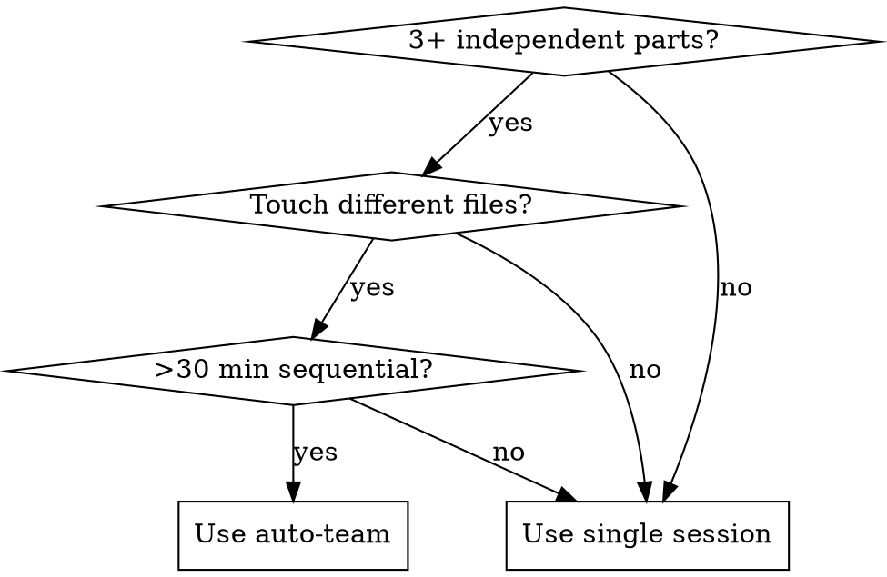

# Auto Team

Orchestrate parallel agent work using native TeamCreate, TaskCreate, and Agent tools with worktree isolation. Each teammate works in an isolated git worktree; results merge into an integration branch.

## When to Use

ALL must be true:
- 3+ independent parts that can run in parallel
- Parts touch different files/modules (no shared-file edits)
- Task would take >30 min sequentially

Do NOT use when:
- Single file edit, small bug fix, simple feature
- Parts depend on each other sequentially
- User explicitly wants single-session work
- Dirty working tree (commit or stash first)



---

## Workflow

### Phase 0: Preflight (NEVER skip)

```bash
git rev-parse --git-dir        # Must be a git repo
git status --porcelain          # Must be clean — if dirty, ask user to commit/stash
git branch --show-current       # Record as ORIGINAL_BRANCH for rollback
git worktree list               # Check no conflicts
```

Stop and inform user if any check fails.

### Phase 1: Plan & Approve

Present plan to user, wait for confirmation:

```
I'll split this into [N] parallel tasks:

1. [task] -> feature/[name] (opus — complex logic)
2. [task] -> feature/[name] (sonnet — implementation)
3. [task] -> feature/[name] (sonnet — tests)

Integration branch: feature/integration-[project]
Cost: ~[N]x single session tokens

Proceed?
```

3-4 teammates max for cost efficiency.

### Phase 2: Create Integration Branch

```bash
git checkout -b feature/integration-[project-name]
```

**NEVER** merge directly to main/master.

### Phase 3: Create Team & Tasks

Use native tools — not bash:

```
TeamCreate({ team_name: "project-name", description: "Brief purpose" })

TaskCreate({ description: "Implement auth module" })
TaskCreate({ description: "Build chart components" })
TaskCreate({ description: "Create API endpoints" })
```

### Phase 4: Spawn Teammates

Use the **Agent** tool for each teammate. Spawn ALL in a **single message** for true parallelism:

```
Agent({
  name: "auth-agent",
  team_name: "project-name",
  model: "opus",
  isolation: "worktree",
  run_in_background: true,
  prompt: "You are on team 'project-name'. Your task: implement auth module.
    1. Check TaskList and claim your task via TaskUpdate (set owner to your name, status to in_progress)
    2. Implement with clear, frequent commits
    3. Run tests/build before final commit
    4. Mark task completed via TaskUpdate
    5. Do NOT modify files outside your scope"
})

Agent({
  name: "charts-agent",
  team_name: "project-name",
  model: "sonnet",
  isolation: "worktree",
  run_in_background: true,
  prompt: "..."
})

Agent({
  name: "api-agent",
  team_name: "project-name",
  model: "sonnet",
  isolation: "worktree",
  run_in_background: true,
  prompt: "..."
})
```

Key parameters:
- `name` — addressable via SendMessage
- `team_name` — joins the team's shared task list
- `model` — "opus" | "sonnet" | "haiku"
- `isolation: "worktree"` — auto-creates isolated git worktree
- `run_in_background: true` — non-blocking parallel execution

### Phase 5: Monitor

- Messages from teammates are **auto-delivered** — do NOT poll
- Teammates go **idle between turns** — this is normal, not an error
- Use **SendMessage** to communicate with teammates by `name`
- Use **TaskList** to check overall progress
- Idle teammates can receive messages — sending wakes them up

### Phase 6: Merge

After all teammates complete, their worktree branches are returned in the Agent result. Worktrees with no changes are auto-cleaned.

```bash
git checkout feature/integration-[project-name]

git merge [branch-from-agent-1] --no-edit
# Run build/tests — if conflict: git merge --abort, ask user

git merge [branch-from-agent-2] --no-edit
# Verify again

git merge [branch-from-agent-3] --no-edit
# Final: build + tests
```

**NEVER auto-resolve merge conflicts.** Abort and ask the user.

### Phase 7: Cleanup

1. Shutdown teammates: `SendMessage({ to: "agent-name", message: { type: "shutdown_request" } })`
2. Wait for all to shut down
3. Delete team: `TeamDelete()` (fails if teammates still active)
4. Prune worktrees and branches:

```bash
git worktree prune
git branch -d feature/[task-branches]
```

### Phase 8: Report

```
Team completed. Summary:

Integration branch: feature/integration-[project-name]

- auth-agent (opus): [what was done, files changed]
- charts-agent (sonnet): [what was done, files changed]
- api-agent (sonnet): [what was done, files changed]

Build: pass | Tests: pass (N/N)
Branches merged and cleaned up.

Ready to merge into main when you approve.
```

---

## Error Handling

| Problem | Action |
|---------|--------|
| Dirty working tree | Stop. Ask user to commit or stash |
| Worktree name conflict | Pick different name or `git worktree prune` stale refs |
| Merge conflict | `git merge --abort`. Ask user — never auto-resolve |
| Build fails after merge | `git revert -m 1 HEAD`. Report which merge broke it |
| Test failure after merge | Report which merge broke tests, offer to revert |
| All merges fail | `git merge --abort`, `git checkout ORIGINAL_BRANCH`. Report |

### Emergency Rollback

```bash
git merge --abort 2>/dev/null
git checkout [ORIGINAL_BRANCH]
git worktree prune
git branch -D feature/integration-[project-name]
git branch -D feature/[task1] feature/[task2] feature/[task3]
```

---

## Model Selection

| Task Type | `model` value |
|-----------|---------------|
| Architecture, complex logic | `"opus"` |
| Features, components, docs | `"sonnet"` |
| Tests, formatting, simple tasks | `"haiku"` |

---

## Cost Control

- 3-4 teammates max
- One focused task per teammate
- Use sonnet/haiku for straightforward work
- Don't use for tasks a single session handles in <30 min
